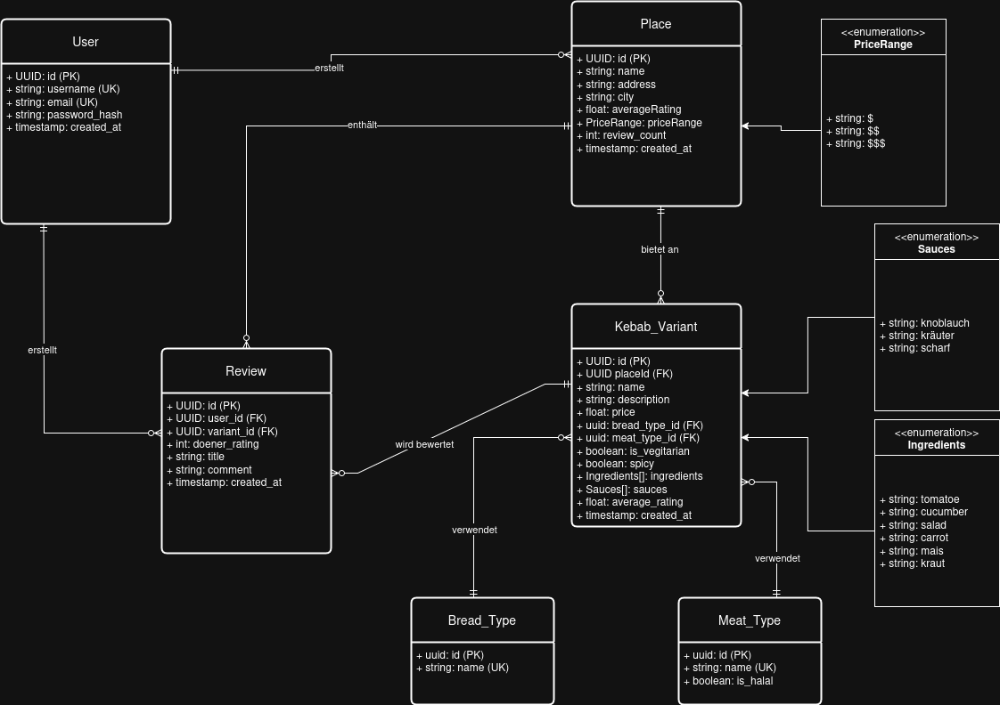
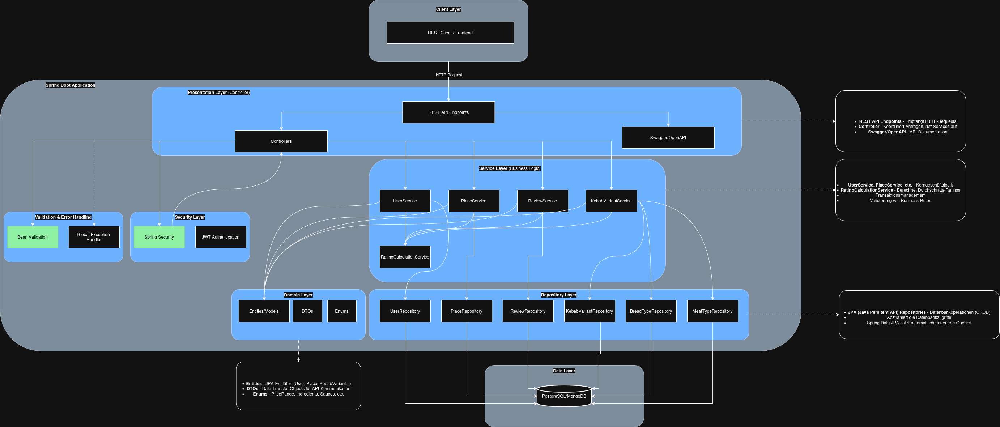

# 🌯 Kebab Rating API

Backend API for kebab rating platform - Spring Boot + Kotlin

## 📋 Table of Contents
- [Tech Stack](#tech-stack)
- [Database Model](#database-model)
- [Architecture](#architecture)
- [Getting Started](#getting-started)
- [API Documentation](#api-documentation)

## 🚀 Tech Stack

- **Language:** Kotlin
- **Framework:** Spring Boot 3.5.1
- **Database:** PostgreSQL / H2
- **Build:** Gradle

## 📊 Database Model
The ER diagram below shows the core entities and their relationships.
The system centers around `Place` (kebab shops) that offer multiple `KebabVariants` options, which users can review.


## 🏗️ Architecture
The Architecture follows a layered approach.


## 🚀 Getting Started

### Prerequisites
- JDK 21
- Docker (for PostgreSQL)

### Run Application
```bash
# Clone repository
# Build project
./gradlew clean build
# Run with H2 (in-memory)
./gradlew bootRun

# Or with Docker Compose (PostgreSQL)
docker-compose up -d
./gradlew bootRun --args='--spring.profiles.active=postgres'
```

### Access

- **API:** http://localhost:8080
- **Swagger UI:** http://localhost:8080/swagger-ui.html
- **H2 Console:** http://localhost:8080/h2-console
- **pgAdmin:** http://localhost:5050  
  - User: `admin@kebab.com`
  - Password: `admin`

## 📚 API Documentation

Full API documentation available at `localhost:8080/swagger-ui.html` when running.

### Example Endpoints
```
GET    /api/places
GET    /api/places/{id}
POST   /api/places
GET    /api/kebabs/top?city=Berlin&limit=10
POST   /api/reviews
```

## 🎯 Features

- ✅ CRUD operations for Places, Kebab Variants, Reviews
- ✅ Rating calculations
- ✅ Filter by city, price, vegetarian
- ✅ Top-rated kebabs
- ⏳ User authentication (planned)

## 🧪 Testing
```bash
# Run all tests
./gradlew test

# Run with coverage
./gradlew test jacocoTestReport
```
Find test report under `build/reports/jacoco/test/html/index.html`.

## 📝 Project Structure
```
src/main/kotlin/com/fladenchef/rating/
├── config/              # Data Seeding
├── controller/          # REST endpoints
├── mapper/              # DTO mappers
├── model/
│   ├── entity/          # JPA entities
│   ├── dto/             # Data transfer objects
│   └── enum/            # Enums (PriceRange, etc.)
├── repository/          # Data access
├── service/             # Business logic

src/test/kotlin/com/fladenchef/rating/
├── service/             # Service tests
```

## 🤝 Contributing

This is a code challenge project. Feedback welcome!